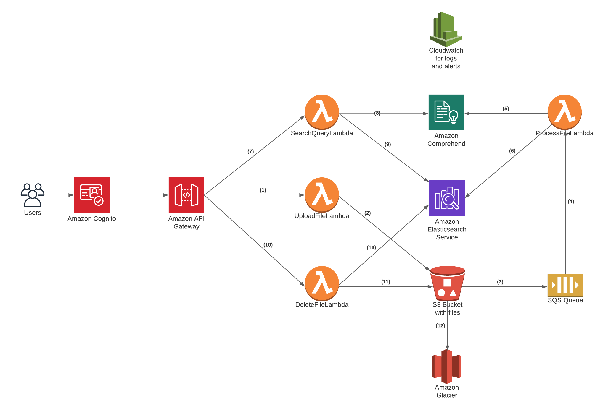

# Architecture

 

**1,2,3,4,5,6** - User uploads(PUT) a file to s3 using apigateway and lambda using cognito custom pool authentication and generates a unique id, this triggers a different lambda through an SQS subscription which calls out to AWS comprehend to get key phrases and other information from the file which then gets saved along with the unique id of file to Elastic search.

**7,8,9** - User perform an NLQ search through api gateway, lambda goes to Amazon Comprehend first to break down the query and then this is used to search against elasticsearch, and the results will be returned.

**10,11,12,13** - User attempts to archive(considering as a soft delete) a file through the apigateway endpoint by passing in the unique id, the file will be moved to aws glacier and all related entries in elasticsearch for the file will be deleted using the unique id

Cloud watch will be used for logging and alerting purposes.


# REST API Design 

```
openapi: 3.0.0
info:
  title: NLP Search API
  description: Performs various operations such as persisting/archiving documents and searching against the exsiting documents

paths:
  /document:
    post:
      summary: Uploads a file
      description: File gets uploaded to an s3 bucket and sends a response back. This kicks off an asynchronous process to extract insights in the file which is then persisted
      requestBody:
        content:
          application/octet-stream:
            schema:
              type: string
              format: binary
      responses:
        '200':
          description: The file is uploaded with a unique id
          content:
            text/plain:
              schema:
                type: integer
                format: int64
                example: 1

  /document/{documentId}:
    delete:
      summary: Archives the file
      description: Moves the file from s3 to glacier, all related relationships are removed
      parameters:
        - in: path
        name: documentId
        schema:
          type: integer
      responses:
        '204':
          description: The file is archived

   /document:
     get:
       summary: Perform an NLQ
       description: Perform a search agasint existing documents based on the passed in searchQuery
       parameters:
         - in: query
         name: searchQuery
         schema:
           type: string
           example: What is the processor of the PS5
       responses:
         '200':
           description: Matches found for search query
           content:
             text/plain:
               schema:
                 type: string
                  example: eight-core AMD Zen 2 CPU
         '404':
           description: No matches found for search query
```

# FileSearchService
An application that is responsible for performing keyword searches against a static file

### Steps to run app locally
##### Option 1: Run app through an IDE
##### Option 2: From terminal go to the root of the project and execute `mvn spring-boot:run`

Openapi 3.0 swagger-ui page: http://localhost:8080/swagger-ui.html